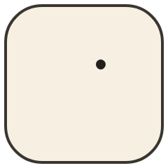
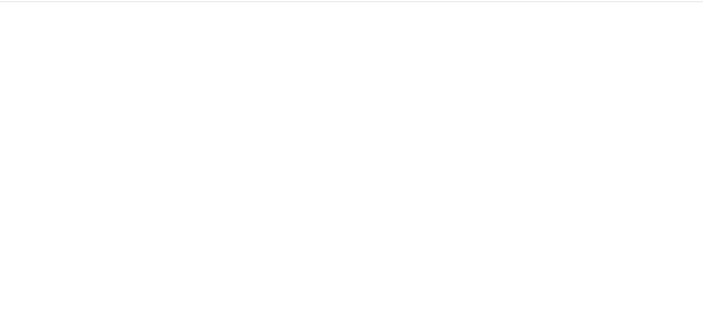

<div align="center">



<h1>svg-animate-web</h1>

<p>A zero-dependency <strong>SVG animation</strong> utility for the web — make icons, logos, and illustrations move with one function call.</p>

[](https://www.npmjs.com/package/svg-animate-web)
[](https://www.npmjs.com/package/svg-animate-web)
[](https://bundlephobia.com/package/svg-animate-web)
[](https://www.npmjs.com/package/svg-animate-web)
[](./LICENSE)

**[English](./README.md)** · **[中文文档](./README.zh-CN.md)** · **[Live Demo](https://svg-animate-web.netlify.app/)** · **[Source](./play/src/App.vue)**

<p align="center">
  
</p>

</div>

---

## ✨ Features

- 🪶 **Zero dependencies** — tiny footprint, no runtime dependencies
- 🧩 **Framework agnostic** — works with Vue, React, Vanilla JS, or any web stack
- 🎨 **Multiple render modes** — `outline`, `fill`, `mixed`, `grow`, `fade-in`
- ⏯️ **Playback control** — `play`, `pause`, `reset` at runtime
- 🔡 **Fully typed** — built with TypeScript

## 📦 Install

```bash
pnpm add svg-animate-web
```

## 🚀 Usage

```ts
import { setSvgAnimation } from 'svg-animate-web'

const svg = document.querySelector<SVGSVGElement>('#my-svg')

setSvgAnimation(svg, {
  duration: 3,
  stroke: '#333',
  strokeWidth: 2,
  count: 'infinite',
})
```

```html
<svg id="my-svg" viewBox="0 0 100 100">
  <path d="M10 10 L90 90" />
  <path d="M90 10 L10 90" />
</svg>
```

Vue / React users can call `setSvgAnimation` after the SVG element is mounted.

## ⚙️ Options

| Option        | Type                              | Default      | Description                         |
| ------------- | --------------------------------- | ------------ | ----------------------------------- |
| `duration`    | `number`                          | `5`          | Animation duration in seconds       |
| `delay`       | `number`                          | `0`          | Initial delay in seconds            |
| `count`       | `number \| string`                | `'infinite'` | Iteration count                     |
| `easing`      | CSS timing function               | `'linear'`   | Animation easing                    |
| `reverse`     | `boolean`                         | `false`      | Play animation in reverse           |
| `fill`        | `string`                          | —            | Fill color override                 |
| `fillBase`    | `string`                          | —            | Base fill color                     |
| `stroke`      | `string`                          | `'#333'`     | Stroke color                        |
| `strokeWidth` | `number`                          | `1`          | Stroke width                        |
| `renderMode`  | `outline \| fill \| mixed \| grow \| fade-in` | path: `outline`, rect: `grow` | Animation style |
| `pathOptions` | `Partial<PathAnimateOptions>`     | —            | Options for path-like elements      |
| `rectOptions` | `Partial<RectAnimateOptions>`     | —            | Options for `<rect>` elements       |
| `onComplete`  | `() => void`                      | —            | Called when animation ends          |

## 🛠️ API

```ts
setSvgAnimation(svg, options?)
setPathAnimation(element, options?)
controlSvgAnimation(svg, 'play' | 'pause' | 'reset')
```

## 🐟 Example

See [`play/src/App.vue`](./play/src/App.vue) for the full demo source.

```bash
pnpm install
pnpm play
```

## 📄 License

<div align="center">

MIT © [Icey Wu](https://github.com/iceywu)

<sub>If this project helps you, consider giving it a ⭐.</sub>

</div>
